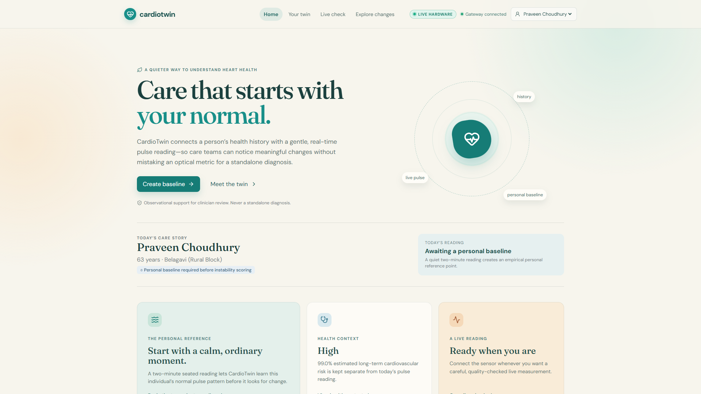
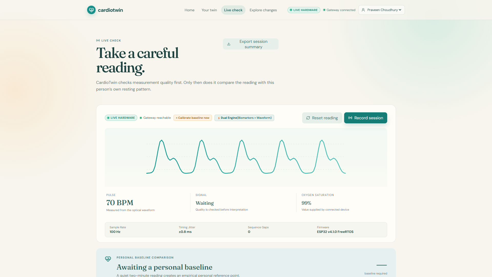
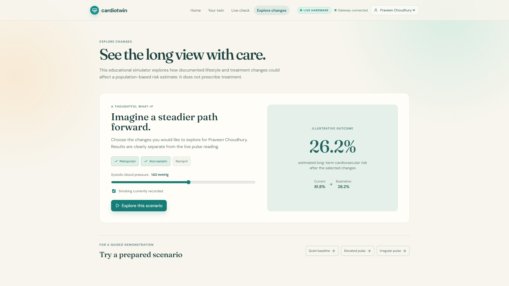
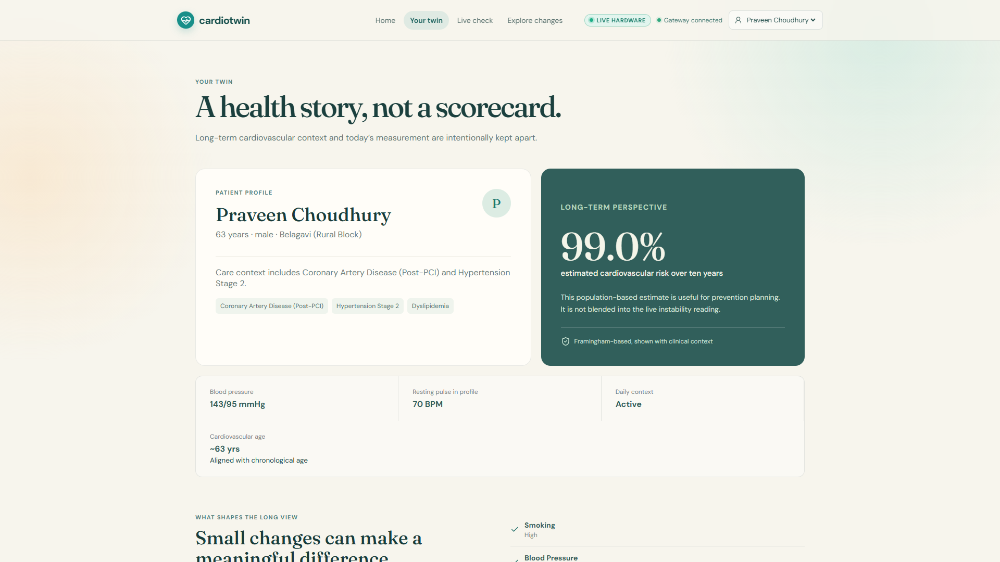

<p align="center">
  
  
</p>

<h1 align="center">🫀 CardioTwin Sentinel</h1>

<p align="center">
  <strong>Personalized Cardiovascular & Cardiometabolic Digital Twin</strong>
</p>

<p align="center">
  <a href="#-demo-video"><strong>📺 Demo Video</strong></a> &nbsp;•&nbsp;
  <a href="docs/EXECUTIVE_SUMMARY.md"><strong>📄 Executive Summary</strong></a> &nbsp;•&nbsp;
  <a href="docs/ARCHITECTURE.md"><strong>🏗️ Architecture</strong></a> &nbsp;•&nbsp;
  <a href="https://github.com/Harsh-15771/IoT-Arrhythmia-Detection"><strong>💻 GitHub Repo</strong></a>
</p>

<p align="center">
  
  
  
  
  
  
  
  
</p>

<p align="center">
  An ultra-low-cost (~₹1,165 / $14) IoT-powered cardiovascular digital twin that learns your personal resting pulse baseline through a 2-minute seated calibration, detects sustained physiological departures using robust non-parametric statistics, explains <em>why</em> departures occur via SHAP game-theoretic feature attribution, and empowers clinicians to simulate preventive What-If treatment outcomes using an ethnicity-recalibrated Framingham Cox proportional hazards engine — all while openly disclosing what it does <em>not</em> know through a machine-readable Evidence Ledger.
</p>

---

## Table of Contents

- [Team Details](#-team-details)
- [Demo Video](#-demo-video)
- [Problem Statement](#-problem-statement)
- [Healthcare Use Case](#-healthcare-use-case)
- [System Architecture](#-system-architecture)
- [Screenshots](#-screenshots)
- [Technical Highlights](#-technical-highlights--core-innovations)
- [AI/ML Model Details](#-aiml-model--framework-details)
- [Technology Stack](#-technology-stack)
- [Project Structure](#-project-structure)
- [Getting Started](#-getting-started)
- [Running Tests](#-running-the-test-suite)
- [Documentation Index](#-documentation-index)
- [Presentation & Architecture Diagrams](#-presentation--architecture-diagrams)
- [Future Scope](#-future-scope)
- [License](#-license)
- [Clinical Disclaimer](#-clinical-disclaimer--regulatory-boundary)

---

## 👥 Team Details

**Team Name:** Root Access (Solo)

| Role | Name | Institution |
|:---|:---|:---|
| **Lead Developer & ML Engineer** | Harsh Mishra | Visvesvaraya National Institute of Technology, Nagpur |

**College / Institution:** Visvesvaraya National Institute of Technology, Nagpur

**Hackathon:** Digital Twin Challenge 2026 — Happiest Health

---

## 📺 Demo Video

<!-- TODO: Upload a 15-20 minute unlisted YouTube video and paste the link below -->

> **🎬 YouTube Demo (Unlisted):** [Coming Soon — Link will be added after upload]
>
> *(15–20 minute walkthrough covering: Problem Statement → Hardware Demo → Personal Baseline Calibration → Live Telemetry → SHAP Explainability → What-If Simulator → Honest ML Disclosure)*

---

## 🎯 Problem Statement

Cardiovascular disease is the **#1 cause of death in India**, accounting for **28% of all mortality** — striking South Asian populations **10–15 years earlier** than Western counterparts. The monitoring gap is severe:

| Current Tool | Cost | Limitation |
|:---|:---:|:---|
| **Apple Watch Series 9** | ₹41,900+ | Proprietary iOS lock-in; unaffordable for 95% of Indians; generic uncalibrated baselines |
| **24–48h Holter Monitor** | ₹5,000–₹12,000/rental | Hospital referral required; multi-lead chest electrodes; 2–3 day manual review delay |
| **Hospital Bedside Monitor** | ₹1,20,000–₹3,50,000 | Mains-powered; non-portable; requires trained ICU nursing staff |
| **Consumer Pulse Oximeter** | ₹600–₹1,200 | Displays only instantaneous number; zero intelligence, zero longitudinal memory |

**The gap:** India has **160,000+ Ayushman Bharat Health & Wellness Centres** in rural and semi-urban areas — but no affordable, intelligent cardiac screening tool that understands the *individual patient*.

---

## 🏥 Healthcare Use Case

CardioTwin Sentinel addresses **personalized cardiovascular screening and cardiometabolic risk simulation** for India's primary care infrastructure:

1. **Personal Baseline Learning** — A 2-minute seated empirical calibration creates a robust statistical fingerprint (Median BPM, MAD, RR-CV, RMSSD) unique to each patient. No population-default guessing.
2. **Real-Time Departure Detection** — Sustained autonomic and rhythm departures are flagged using robust non-parametric statistics (Median Absolute Deviation), not arbitrary threshold rules.
3. **Dual-Modality Arrhythmia Screening** — Fuses 27-biomarker classical ML (XGBoost + Random Forest + ExtraTrees) with deep 1D CNN waveform analysis for 8-class rhythm classification across 2,271 real ICU/ambulatory patients.
4. **Explainable AI for Clinicians** — SHAP TreeExplainer attributions tell clinicians *which biomarkers* drove each screening result, not just a probability score.
5. **What-If Treatment Simulator** — Framingham Cox proportional hazards model (recalibrated with $1.45\times$ South Asian multiplier) lets clinicians simulate the longitudinal impact of SBP reduction, statin therapy, and smoking cessation on 10-year cardiovascular event risk.
6. **Evidence Ledger & Honest Disclosure** — Every telemetry evaluation carries machine-readable limitation disclosures (no SpO₂, no 12-lead ECG equivalence, ICU dataset bias).

**Target deployment:** Rural Sub-Centres, Tier-2/3 District Clinics, Ayushman Bharat HWCs — at **~₹1,165 ($14) per device**, making mass screening economically viable.

---

## 🏗️ System Architecture

```
┌─────────────────────────────────────────────────────────────────────────────┐
│                          STREAM 1: PATIENT EHR                              │
│  Demographics, Vitals, Lipid Panel, HbA1c, Smoking, South Asian Multiplier   │
│  Framingham 10-Year Cardiovascular Event Risk (Cox Proportional Hazards)   │
└──────────────────────────────────────┬──────────────────────────────────────┘
                                       │
                                       ▼
┌─────────────────────────────────────────────────────────────────────────────┐
│                     STREAM 2: IOT OPTICAL TELEMETRY                         │
│  ESP32 FreeRTOS (Core 1: 100 Hz Optical Capture | Core 0: WiFi JSON Stream) │
│  MAX30102 PPG Waveform ──► Decoupled 5-Part Signal Reliability Gate         │
└──────────────────────────────────────┬──────────────────────────────────────┘
                                       │
                                       ▼
┌─────────────────────────────────────────────────────────────────────────────┐
│               PERSONAL BASELINE & INSTABILITY ENGINE (0–100)                │
│  • Empirical 2-Min Seated Calibration (Median, MAD, RR-CV, RMSSD)           │
│  • Robust Z-Score Distance Metrics (Pulse Rate, Irregularity, Vagal Tone)   │
│  • Multi-Window Temporal Persistence Consensus Memory                       │
└──────────────────────────────────────┬──────────────────────────────────────┘
                                       │
                                       ▼
┌─────────────────────────────────────────────────────────────────────────────┐
│                  DUAL-MODALITY CLINICAL SCREENING ENGINE                    │
│  • Modality A: Classical Super Ensemble (XGB+RF+ET on 27 Biomarkers)        │
│  • Modality B: Inception-1D Deep Convolutional Waveform Champion            │
│  • Optimal Fusion: 38% Classical + 62% Deep Learning (Nested Group-CV)      │
│  • SHAP Game-Theoretic Feature Attribution & Machine Evidence Ledger        │
└──────────────────────────────────────┬──────────────────────────────────────┘
                                       │
                                       ▼
┌─────────────────────────────────────────────────────────────────────────────┐
│                     CLINICIAN DECISION SUPPORT PORTAL                       │
│  • Real-Time Oscilloscope Waveform & Baseline Departure HUD (React 19)      │
│  • Biological Vascular Age Estimation & Instability Score (0–100)           │
│  • Interactive Framingham What-If Treatment Outcome Simulator               │
│  • ABDM / HL7 FHIR R4 Clinician Report Exporter                             │
└─────────────────────────────────────────────────────────────────────────────┘
```

> **Architecture diagram is also available in PDF format:** See [Presentation & Architecture Diagrams](#-presentation--architecture-diagrams)

---

## 📸 Screenshots

<!-- TODO: Add screenshots of the live application. Recommended screenshots:
     1. Home screen with patient profile and vascular age
     2. Live Check with waveform and SHAP attribution
     3. What-If Treatment Simulator
     4. Footer with clinical disclosure
     Place screenshots in a ./screenshots/ directory and reference them below. -->

<table width="100%">
  <tr>
    <th width="50%">Home — Patient Profile & Normal Baseline</th>
    <th width="50%">Live Check — Real-Time Waveform & Telemetry Integrity</th>
  </tr>
  <tr>
    <td align="center">
      
      <br><i>Patient overview with quiet baseline reference, clinical context, and dual-engine status</i>
    </td>
    <td align="center">
      
      <br><i>Real-time optical PPG waveform (100 Hz, ±0.8ms jitter), signal gate validation, and baseline comparison</i>
    </td>
  </tr>
  <tr>
    <th width="50%">What-If Treatment Simulator</th>
    <th width="50%">Digital Twin Profile & Long-Term Context</th>
  </tr>
  <tr>
    <td align="center">
      
      <br><i>Educational Framingham Cox simulator demonstrating projected 10-year CVD risk reduction from therapies</i>
    </td>
    <td align="center">
      
      <br><i>Digital twin health story with Framingham perspective, biological vascular age, and longitudinal context</i>
    </td>
  </tr>
</table>

---

## 🌟 Technical Highlights & Core Innovations

### 1. Dual-Core FreeRTOS Embedded Firmware
- **Core 1 (Hardware ISR & Sampling):** Runs a high-priority FreeRTOS task sampling the MAX30102 optical sensor at exactly 100 Hz ($10{,}000\,\mu\text{s}$ interval) using hardware microsecond timing.
- **Core 0 (Networking & Buffering):** Decoupled FreeRTOS task handles WiFi transmission, HTTP polling, and JSON serialization without stalling optical acquisition.
- **Hardware Telemetry Integrity:** Transmits `device_boot_id`, sequential chunk numbering (`seq`), and microsecond timestamps for jitter and drift detection.

### 2. Personal Baseline Governance (Zero Population Defaults)
- **Empirical Calibration Requirement:** Requires at least 6 high-quality, post-settling 10-second windows (>60 s of clean seated data).
- **No Population Guessing:** Uncalibrated users return `instability_score: null` and status `"Personal baseline required"`.
- **Robust Non-Parametric Statistics:** Tracks Median and Median Absolute Deviation (MAD), eliminating sensitivity to outlier spikes.
- **Strict Invalidation Rules:** Baselines expire after 30 days or immediately if device ID or optical sensor configuration changes.

### 3. Decoupled 5-Part Signal Reliability Gate
- **Physical Reliability (Blocks AI):** Detects finger-off (<20k ADC ceiling), amplifier saturation (>260k ADC), and sample timing jitter.
- **Physiological Plausibility (Informs AI):** Extreme rates (<40 BPM or >180 BPM) or chaotic rhythms (AFib, VT) are **not gated out as noise** — they pass through as verified physiological observations marked for clinical review.

### 4. Dual-Modality Fusion with Nested Group-CV
- 10-model tournament across 4 architectures, evaluated on **2,271 unique patients** from real ICU/ambulatory datasets.
- Classical + Deep Learning fusion with **optimal weights discovered per outer fold** (mean: 38% Classical + 62% DL).
- **Zero patient leakage:** StratifiedGroupKFold ensures no patient appears in both train and test within any fold.

### 5. Explainable AI & Clinical Evidence Ledger
- **SHAP TreeExplainer** on 27 biomarkers surfaces per-class feature importances.
- **Natural-language explanations** describe exact deviation in BPM, RR-CV, and RMSSD with temporal duration context.
- **Evidence Ledger** — machine-readable limitation disclosures accompany every evaluation.

---

## 🤖 AI/ML Model & Framework Details

### Training Data — Real Clinical Datasets (No Synthetic ML Data)

| Dataset | Source | Patients | Use | License |
|:---|:---|:---:|:---|:---|
| **MIMIC-III Waveform** | MIT / Beth Israel Deaconess | ~2,000 | AFib, Bradycardia, Tachycardia, Cardiac Paced, Normal | PhysioNet Credentialed |
| **PhysioNet CinC 2015** | Computing in Cardiology Challenge | 231 | VT, VFib, Asystole (true ICU alarms) | PhysioNet Open |
| **BUT PPG v2.0** | Brno University of Technology | 39 | Wearable smartphone optical noise | PhysioNet Open |
| **BIDMC** | Beth Israel Deaconess | — | Hospital ICU telemetry baseline | PhysioNet Open |
| **Total** | **4 datasets** | **2,271** | **4,683 windows across 8 rhythm classes** | |

> **Transparency:** 100% of VT and Asystole instances originate from CinC 2015 ICU alarm recordings. This source concentration is [openly disclosed](docs/SOURCE_CONFOUNDING_AUDIT.md), not hidden.

### Model Architectures

**Deep Learning Champion — Inception-1D CNN:**
- Multi-scale 1D convolutional architecture with inception modules
- Input: Raw 1000-sample PPG waveform (10 seconds @ 100 Hz)
- Parameters: **393,224** (1.61 MB checkpoint)
- Trained with data augmentation on Google Colab GPU
- Framework: **PyTorch 2.0+**

**Classical Super Ensemble — XGBoost + Random Forest + ExtraTrees:**
- 27 hand-crafted physiological biomarkers (BPM, RMSSD, SDNN, pNN50, RR-CV, LF/HF ratio, SQI, etc.)
- Soft-voting ensemble of 3 gradient-boosted / bagged classifiers
- Framework: **scikit-learn 1.4+ / XGBoost 2.0+**
- SHAP TreeExplainer for per-prediction feature attribution

**Dual-Modality Fusion:**
- Optimal late fusion of classical ensemble + Inception-1D predictions
- Weights selected via inner-fold grid search within nested cross-validation
- Final: **38% Classical + 62% Deep Learning** (mean across outer folds)

### Validation Protocol

```
Nested 5-Fold StratifiedGroupKFold (Patient-Isolated, Zero Leakage)
├── Outer Fold 1–5: Test Performance (never seen during weight tuning)
│   └── Inner Fold 1–5: Fusion Weight Selection (grid search)
└── Patient grouping: No patient appears in both train and test in any fold
```

### Clinical Risk Engine

- **Framingham Cox Proportional Hazards** model for 10-year cardiovascular event risk
- **South Asian recalibration:** $1.45\times$ risk multiplier per ESC/EAS guidelines
- **What-If Simulation:** SBP reduction, statin therapy, smoking cessation, diabetes management
- **Biological Vascular Age** estimation based on cardiovascular risk factor profile

> 📊 **Verified Performance Benchmarks:** CardioTwin strictly reports leak-free, patient-isolated cross-validation metrics (Nested Dual Fusion: **53.92% Macro-F1**, Inception-1D Champion: **51.81% Macro-F1**, Classical Super Ensemble: **48.00% Macro-F1** across 2,271 patients). For complete 5-fold cross-validation tables, per-class sensitivity/specificity, deep learning tournament results, and operational safety audits, see [`docs/PERFORMANCE_MATRIX.md`](docs/PERFORMANCE_MATRIX.md) and [`docs/MODEL_CARD.md`](docs/MODEL_CARD.md).

---

## 🛠️ Technology Stack

| Layer | Technology | Version | Purpose |
|:---|:---|:---|:---|
| **Frontend** | React | 19 | Component-based clinical dashboard with hooks |
| | Vite | latest | Sub-second HMR, ESBuild bundling |
| | Lucide React | — | Consistent medical-grade icon system |
| | Socket.IO Client | — | Real-time WebSocket telemetry streaming |
| **Backend** | Python | 3.11 | Core runtime |
| | Flask | 3.0+ | REST API with 17 endpoints |
| | Flask-SocketIO | 5.3+ | WebSocket server for live telemetry broadcast |
| | Werkzeug | 3.0+ | WSGI utilities |
| **ML / AI** | PyTorch | 2.0+ | Inception-1D deep learning CNN |
| | XGBoost | 2.0+ | Gradient-boosted classical ensemble |
| | scikit-learn | 1.4+ | Random Forest, ExtraTrees, preprocessing, CV |
| | SHAP | 0.45+ | TreeExplainer local feature attributions |
| | NumPy | 1.26+ | Signal processing and array operations |
| | SciPy | 1.13+ | Statistical analysis and spectral methods |
| | Pandas | 2.2+ | Data pipeline and feature engineering |
| | Matplotlib | 3.8+ | SHAP plots and confusion matrices |
| **Signal** | wfdb | 4.1+ | PhysioNet waveform database I/O |
| | Joblib | 1.3+ | Model serialization |
| **Hardware** | ESP32-WROOM-32D | — | Dual-core Xtensa LX6 @ 240 MHz, FreeRTOS |
| | MAX30102 | — | High-sensitivity PPG optical sensor (18-bit ADC) |
| | SSD1306 OLED | — | 0.96" I2C status display |
| | TP4056 + LiPo | — | USB-rechargeable power management |
| **Testing** | unittest | stdlib | 49-test suite: clinical, signal, baseline, API |
| **Infra** | Git / GitHub | — | Version control, CI |

---

> 🧠 **Engineering Decisions & Tradeoffs:** For detailed rationale on why dual-modality fusion outperforms single models, why Inception-1D won over LSTMs/Transformers, personal baseline calibration vs. population thresholds, MAD non-parametric statistics, and South Asian Framingham recalibration, see [`docs/ENGINEERING_DECISIONS.md`](docs/ENGINEERING_DECISIONS.md).

---

## 📁 Project Structure

```
IoT-Arrhythmia-Detection/
├── frontend/                                # Clinician-Facing Web Application
│   ├── web/                                 # React 19 + Vite SPA
│   │   ├── src/
│   │   │   ├── App.jsx                     # Root application: 4-tab clinical portal (Home, Twin, Live, Plan)
│   │   │   ├── index.css                   # Design system: editorial typography, clinical color tokens
│   │   │   └── main.jsx                    # React DOM entry point with Socket.IO provider
│   │   ├── public/
│   │   │   ├── favicon.svg                 # CardioTwin heart favicon
│   │   │   └── icons.svg                   # SVG icon sprite
│   │   ├── index.html                      # SEO meta tags, Google Fonts (Inter)
│   │   ├── vite.config.js                  # Proxy configuration for backend API
│   │   └── package.json                    # React 19, Socket.IO client, Lucide icons
│   └── mobile/                              # React Native mobile companion (experimental)
│       ├── App.js                          # Expo-based mobile telemetry viewer
│       └── package.json
│
├── backend/                                 # Python Flask API Server
│   ├── api_server.py                       # Flask + Socket.IO app with 17 REST endpoints & WebSocket
│   ├── digital_twin_engine.py              # Patient digital twin: vitals, EHR, cardiovascular age
│   ├── dual_engine.py                      # Dual-modality fusion: classical + deep learning screening
│   ├── framingham_risk.py                  # Framingham Cox PH model with 1.45× South Asian recalibration
│   ├── personal_baseline.py                # Empirical 2-min seated calibration with MAD-based departure
│   ├── signal_gate.py                      # 5-part signal reliability gate (finger-off, saturation, jitter)
│   ├── pulse_rules.py                      # Physiological plausibility rules for HR/rhythm classification
│   ├── ehr_generator.py                    # 100-patient Indian demographic EHR cohort generator
│   ├── synthetic_patients.json             # Pre-generated patient cohort with Framingham risk profiles
│   └── baselines/                          # Serialized personal baseline data (gitkeep)
│
├── ml/                                      # ML Training & Data Pipeline
│   ├── CardioTwin_1D_CNN_Colab.ipynb       # Google Colab training notebook (GPU-accelerated)
│   ├── build_clean_dataset.py              # PhysioNet waveform extraction & 27-feature engineering
│   ├── train_1d_cnn.py                     # Inception-1D CNN training with StratifiedGroupKFold
│   ├── train_unified_models.py             # Classical super ensemble training pipeline
│   └── export_colab_data_and_notebook.py   # Colab ↔ local data synchronization
│
├── model/                                   # Trained Model Artifacts (Checked In)
│   ├── ppg_1d_cnn.pt                       # Inception-1D CNN checkpoint (393K params, 1.61 MB)
│   ├── super_ensemble.pkl                  # XGBoost + RF + ExtraTrees soft-voting ensemble
│   ├── xgboost_ppg_model.pkl               # Standalone XGBoost classifier
│   ├── scaler.pkl                          # StandardScaler for 27-feature normalization
│   ├── label_encoder.pkl                   # 8-class label encoding (AFib → V_Tachycardia)
│   ├── feature_names.pkl                   # Ordered feature name list
│   ├── cnn_metadata-1.json                 # Inception-1D champion: 51.81% Macro-F1 benchmark
│   ├── dual_modality_benchmark_v2.json     # Canonical nested fusion: 53.92% Macro-F1 benchmark
│   ├── oof_predictions_cnn.npz             # Out-of-fold CNN predictions for fusion
│   ├── oof_predictions_classical.npz       # Out-of-fold classical predictions for fusion
│   ├── confusion_matrix_cnn.png            # Inception-1D confusion matrix visualization
│   ├── confusion_matrix_xgboost.png        # XGBoost confusion matrix visualization
│   └── shap_feature_importance.json        # Per-class SHAP feature importance rankings
│
├── hardware/                                # ESP32 Embedded Firmware
│   └── esp32_ppg_sender/
│       └── esp32_ppg_sender.ino            # FreeRTOS dual-core firmware (Core 1: 100Hz capture, Core 0: WiFi)
│
├── scripts/                                 # Verification, Audit & Analysis Scripts
│   ├── generate_shap_explanations.py       # SHAP TreeExplainer → summary plots & feature rankings
│   ├── audit_source_confounding.py         # Cross-dataset provenance & class concentration audit
│   ├── audit_visual_segments.py            # Visual PPG segment morphology grid
│   ├── evaluate_dual_pipeline_v2.py        # Nested dual-modality fusion benchmark
│   ├── benchmark_classical_models.py       # 10-model classical tournament
│   ├── compute_session_quality_report.py   # Post-recording session quality analysis
│   ├── record_validation_session.py        # Live hardware validation recording
│   └── validate_hardware_recordings.py     # Offline hardware recording verification
│
├── tests/                                   # Automated Test Suite (49 Tests)
│   ├── test_cardiotwin.py                  # Core: clinical engine, signal gate, baseline, API (41 tests)
│   └── test_instability_target_validation.py  # Physiological target validation (8 tests)
│
├── docs/                                    # Technical Documentation (4 Authoritative Documents)
│   ├── EXECUTIVE_SUMMARY.md                # 1-page executive pitch, architecture highlights & scorecard
│   ├── ARCHITECTURE.md                     # End-to-end system design, engineering rationale, BOM & ABDM FHIR
│   ├── MODEL_CARD.md                       # AI model benchmarks, 2,271-patient cohort, SHAP XAI & audits
│   └── CLINICAL_EVALUATION.md              # Clinical evidence, 15-paper literature mapping & South Asian risk
│
├── requirements.txt                         # Python dependencies (pinned)
├── .env.example                             # Environment variable template
├── .gitignore                               # Python, Node, IDE, OS exclusions
├── LICENSE                                  # MIT License with clinical research disclaimer
│
└── README.md                                # ← You are here
```

---

## ⚡ Getting Started

### Prerequisites

- **Python 3.10+** (recommended: 3.11)
- **Node.js 18+** (for frontend)
- **Git**
- **ESP32 + MAX30102** (optional — for live hardware; simulated scenarios work without hardware)

### 1. Clone & Install

```bash
# Clone the repository
git clone https://github.com/Harsh-15771/IoT-Arrhythmia-Detection.git
cd IoT-Arrhythmia-Detection

# Create Python virtual environment
python -m venv venv

# Activate (Windows)
.\venv\Scripts\activate

# Activate (macOS / Linux)
# source venv/bin/activate

# Install pinned dependencies
pip install -r requirements.txt
```

### 2. Configure Environment (Optional)

```bash
cp .env.example .env
# Edit .env with your ESP32 IP if using real hardware
# The system works fully without hardware via simulated scenarios
```

### 3. Launch Backend API Server

```bash
python backend/api_server.py
```

> Starts Flask + Socket.IO server on `http://127.0.0.1:5000` with 17 REST endpoints and WebSocket telemetry broadcast.

### 4. Launch Frontend Dashboard

```bash
cd frontend/web
npm install
npm run dev
```

> Open `http://localhost:5173` to interact with the live clinical command portal.

### 5. (Optional) Flash ESP32 Hardware

```
1. Open hardware/esp32_ppg_sender/esp32_ppg_sender.ino in Arduino IDE
2. Set your WiFi SSID, password, and backend server IP
3. Flash to ESP32 via USB
4. Perform 2-minute seated calibration with finger on MAX30102 sensor
```

---

## 🧪 Running the Test Suite

```bash
python -m unittest discover -s tests -p "test_*.py" -v
```

**Expected output:**

```
test_afib_episode_scenario ... ok
test_calm_normal_scenario ... ok
test_finger_off_scenario ... ok
test_motion_artifact_scenario ... ok
test_stress_tachycardia_scenario ... ok
...
----------------------------------------------------------------------
Ran 49 tests in 1.399s

OK
```

> All 49 tests pass across: clinical engine, signal gate, personal baseline, API contract, instability target validation, and physiological plausibility conditions.

### Running Audit & Explainability Scripts

```bash
# Generate SHAP feature importance & plots
python scripts/generate_shap_explanations.py

# Run dataset provenance & source confounding audit
python scripts/audit_source_confounding.py

# Run visual segment morphology audit
python scripts/audit_visual_segments.py

# Evaluate dual-modality fusion benchmark
python scripts/evaluate_dual_pipeline_v2.py
```

---

## 📑 Documentation Index

| Document | Focus & Coverage |
|:---|:---|
| [`docs/EXECUTIVE_SUMMARY.md`](docs/EXECUTIVE_SUMMARY.md) | **1-Page Executive Pitch & Scorecard:** Value proposition, 6 wow factors, and benchmark summary. |
| [`docs/ARCHITECTURE.md`](docs/ARCHITECTURE.md) | **End-to-End System Technical Reference:** Dual clinical streams, engineering decisions, ESP32 BOM (₹1,165), edge privacy (DPDP 2023), and ABDM / HL7 FHIR R4 integration. |
| [`docs/MODEL_CARD.md`](docs/MODEL_CARD.md) | **Unified AI Model & Data Card:** 2,271-patient cohort provenance, leak-free 5-fold CV benchmarks (53.92% Macro-F1), DL tournament, SHAP explainability, and source confounding audits. |
| [`docs/CLINICAL_EVALUATION.md`](docs/CLINICAL_EVALUATION.md) | **Clinical Rigor & Evidence:** $1.45\times$ South Asian Framingham recalibration, interactive "What-If" treatment simulator, and 15 peer-reviewed papers mapped to code. |

---

## 📎 Presentation & Architecture Diagrams

<!-- TODO: Create and upload these files, then update the links below -->

| Asset | Format | Link |
|:---|:---|:---|
| **Architecture Diagram** | PDF / PPT | `📎 Placeholder — upload to ./docs/CardioTwin_Architecture_Diagram.pdf` |
| **Project Presentation** | PDF / PPT | `📎 Placeholder — upload to ./docs/CardioTwin_Presentation.pdf` |
| **Demo Video** | YouTube (Unlisted) | `📎 Placeholder — paste YouTube link after upload` |

> All files and links will be publicly accessible without additional permissions once uploaded.

---

## 🔮 Future Scope

- **Multi-lead ECG expansion** — Integrate ADS1292R or MAX86150 for 2-lead ECG acquisition, enabling ST-segment analysis and P-wave morphology
- **Federated learning across HWCs** — Train population-level models across multiple Ayushman Bharat centres without sharing raw patient data
- **ABDM / FHIR R4 integration** — Export screening reports as HL7 FHIR Observation resources compatible with India's Ayushman Bharat Digital Mission
- **Continuous SpO₂ monitoring** — Add red LED channel for pulse oximetry (currently declared unavailable rather than fabricated)
- **Mobile companion app** — React Native app for patient self-monitoring with push notifications for baseline departures
- **Active learning loop** — Use clinician feedback (confirm/override screening results) to retrain models on real-world outcomes
- **Edge deployment** — Package backend + ML inference as a single Docker container for on-premise deployment in data-residency-restricted environments

---

## 📜 License

This project is licensed under the **MIT License** — see the [`LICENSE`](LICENSE) file for details.

```
MIT License
Copyright (c) 2026 CardioTwin Research Team

Permission is hereby granted, free of charge, to any person obtaining a copy
of this software and associated documentation files (the "Software"), to deal
in the Software without restriction, including without limitation the rights
to use, copy, modify, merge, publish, distribute, sublicense, and/or sell
copies of the Software...
```

> **Clinical Research Disclaimer:** CardioTwin is an exploratory decision-support system developed for research and demonstration purposes. It does not provide autonomous clinical diagnoses, nor does it replace physician judgment or standard-of-care 12-lead diagnostic electrocardiograms (ECG).

---

## ⚖️ Clinical Disclaimer & Regulatory Boundary

CardioTwin Sentinel is an **investigational clinical decision-support and digital twin prototype** developed for the Digital Twin Challenge 2026 (Happiest Health).

1. **PPG ≠ ECG.** Photoplethysmography measures volumetric microvascular pulse waves, not myocardial electrical vectors. It cannot diagnose acute myocardial infarction, ST elevation/depression, bundle branch blocks, or definitive ventricular arrhythmias.
2. **Screening, not diagnosis.** All alerts explicitly declare: *"Investigational prototype — clinical 12-lead ECG review required."*
3. **Decision support, not autonomous prescription.** The system is designed to support clinical triage, track longitudinal resting baseline stability, and explore preventive cardiometabolic scenarios — not autonomously prescribe medications or replace board-certified physicians.
4. **Honest metrics.** We report leak-free, patient-isolated cross-validation numbers (53.92% Nested Fusion Macro-F1). We do not inflate accuracy claims.

---

<p align="center">
  <sub>Built with 🫀 for the Digital Twin Challenge 2026 — Happiest Health</sub>
</p>
<p align="center">
  <sub>Authored by Harsh Mishra & the CardioTwin Sentinel Engineering Team</sub>
</p>
